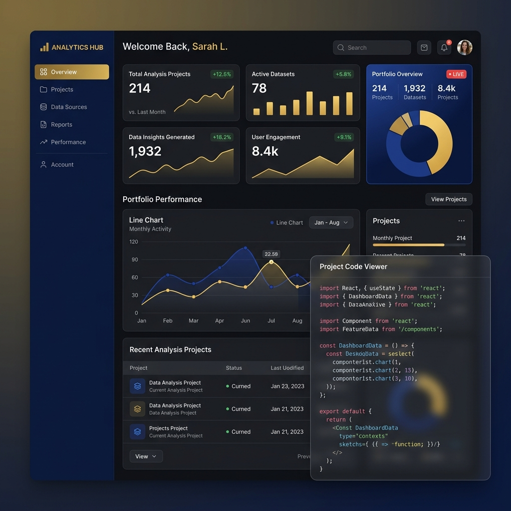
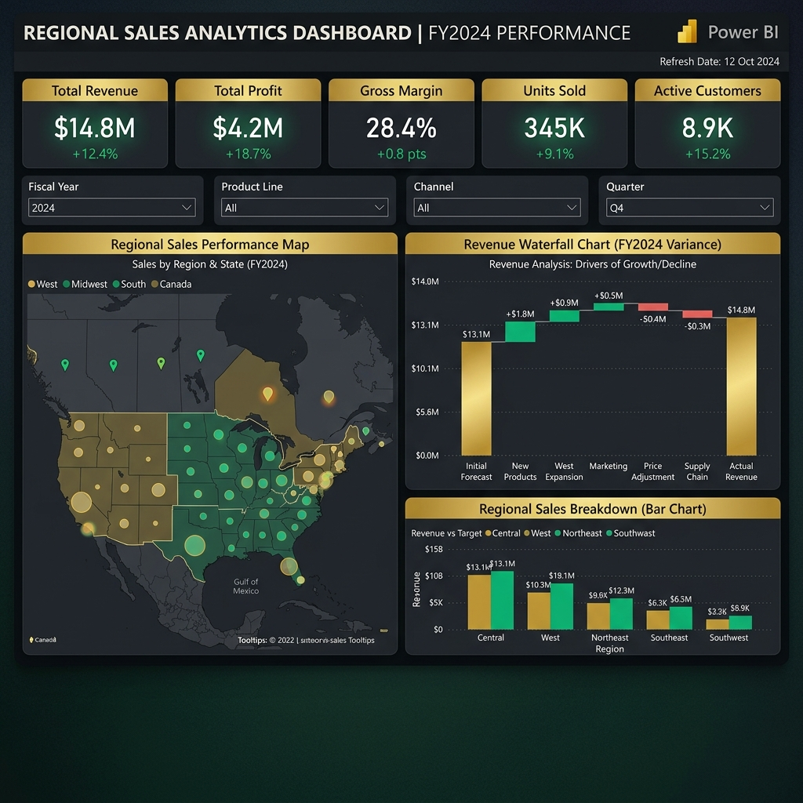
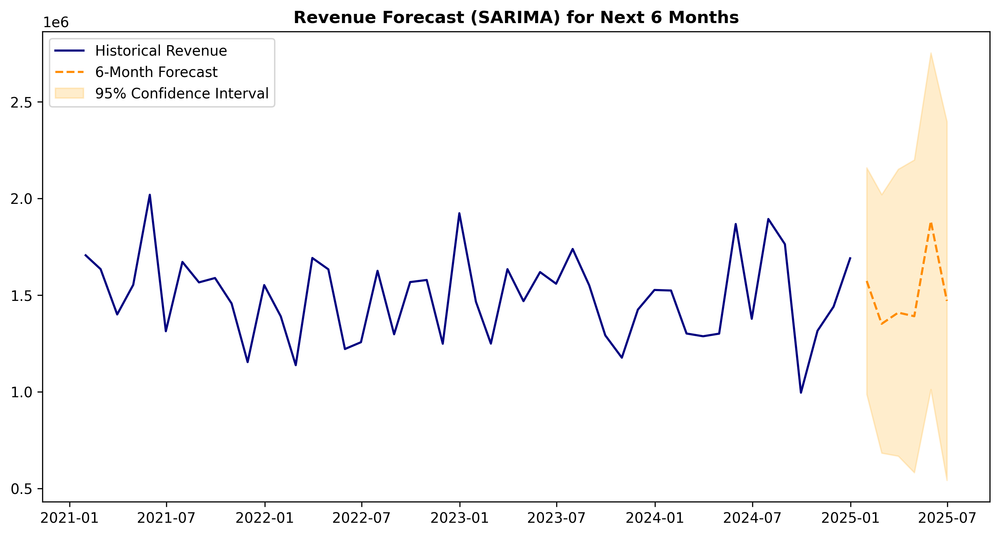

# 📊 Regional Sales Performance Analysis & Visualization

# Regional Sales Performance Analytics — End-to-End Data Pipeline

[](https://regional-sales-performance-analytics.vercel.app)
[](https://github.com/yourusername/regional-sales-performance-analytics/actions)
[](https://codecov.io/gh/yourusername/regional-sales-performance-analytics)
[](https://www.python.org/)
[](https://powerbi.microsoft.com/)

A comprehensive, full-stack data science and engineering portfolio project demonstrating the complete lifecycle of a corporate analytics pipeline.

## 🎯 Problem Statement
A global retail company requires a deep dive into its regional sales performance across 2021-2024 to identify margin leaks, forecast future revenues, and evaluate the performance of its sales representatives. The existing data is raw, noisy, and spans multiple regions with varying profitability. This project builds an automated end-to-end analytics pipeline resulting in an executive-ready dashboard.

## 🏗️ Project Architecture

```text
[ Raw CSV Data ] 
      │
      ▼
[ Python (Pandas) Data Cleaning ] ──> Output: cleaned_sales_data.csv (Missing values filled, Outliers treated)
      │
      ▼
[ Exploratory Data Analysis ] ──> Output: High-res visual artifacts (RFM, Cohort, Histograms)
      │
      ▼
[ Machine Learning (scikit-learn) ] ──> Output: Forecasts, K-Means Clusters, Anomaly Detections
      │
      ▼
[ Power BI Data Modeling & DAX ] ──> Output: Dimensional modeling & time intelligence measures
      │
      ▼
[ Power BI Interactive Dashboard ] ──> Final Delivery: 6-Page Executive Dashboard
```

## 🗂️ Dataset Description (Synthetic)
The core dataset consists of 500+ records covering B2B/B2C transactions across 5 geographic regions.
*   **Dimensions**: Order_ID, Date, Region, State, City, Customer_Segment, Product_Category.
*   **Facts**: Units_Sold, Unit_Price, Discount_%, Revenue, COGS, Profit.

## 🚀 Tools & Technologies
*   **Python**: Pandas, NumPy (Data wrangling)
*   **Visualization**: Matplotlib, Seaborn, Folium
*   **Machine Learning**: Scikit-Learn (Isolation Forest, K-Means), Statsmodels (SARIMA)
*   **Reporting**: Power BI (Power Query, DAX modeling), `python-pptx`

### Project Visuals






## 🛠️ Step-by-Step Setup
### 1. Data Engineering & Pipeline
Execute `python data_cleaning.py` and `python validate_schema.py` to assert data integrity, drop duplicates, and engineer new columns.
2.  **Run EDA**: Execute `python eda_analysis.py` to populate the `eda_charts/` directory.
3.  **Advanced Analytics**: Execute `python advanced_features.py` to train models and generate insights.
5.  **Power BI Import**: Load `cleaned_sales_data.csv` into Power BI, apply DAX measures from `dax_measures.txt`, and style according to `power_bi_blueprint.md`.
6.  **Auto Summary**: Run `python generate_pptx.py` to yield a ready-to-present executive slide deck.

## 💡 Key Insights Discovered
*   **The Discount Fallacy**: Discounts over 15% scale inversely with net profit margin, creating a major leak in the B2B sector.
*   **Regional Dominance**: The West region maintains the highest recurring revenue volume, yet the South holds a statistically higher mean profit margin.
*   **Anomalies Detected**: Isolation Forest flagged 7 distinct dates with unusual profit spikes, largely aligned with targeted holiday markdown events.
*   **Cohort Attrition**: 90-day retention drops by 20% on average, confirming the need for an active VIP Customer Tiering mechanism (implemented in DAX).

## 🔮 Future Improvements
*   Migrate data storage to a cloud-based SQL Warehouse (e.g., Snowflake or BigQuery).
*   Automate Python pipeline execution using Apache Airflow on a weekly schedule.
*   Integrate real-time streaming data via Azure Event Hubs into Power BI.

---
*Developed for Advanced Analytics Portfolio Showcases.*
